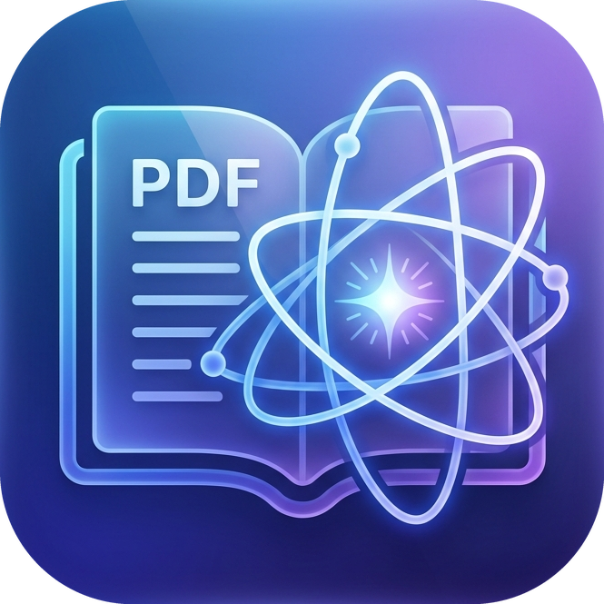

<div align="center">
  
  <h1>OpenSciReader</h1>
  <p><h3>为科研打造的本地 AI PDF 阅读器 (Academic PDF Reader with AI)</h3></p>
  <p><strong>Wails + React · 双栏对照 · 实时排版级翻译 · 沉浸式阅读体验</strong></p>

  <div>
    
    
    
    
    
  </div>
</div>

---

OpenSciReader is a modern, Wails-based desktop reader tailored for local academic PDF workflows, designed to provide a seamless reading, translation, and research experience.

This branch includes a local PDF layout-translation pipeline built around Go job orchestration, a private Python worker (`pdf2zh_next.high_level.do_translate_async_stream`), a React page-by-page preview replacement, and an AI workspace knowledge layer.

## ✨ 核心特性 (Features)

### 🎯 阅读与翻译 (Reading & Translation)
- **🧠 本地排版级翻译 (Local PDF Layout Translation):** View translations while preserving the original layout.
- **📖 双栏阅读模式 (Dual-column reading mode):**
  - Left column: Original PDF
  - Right column: Translated pages replaced chunk by chunk.
- **⚡ 分块加载预览 (Chunk-based Translation Preview):** Preview translations in 25-page chunks for optimized performance.
- **📚 图书级导出 (Whole-book Export):** Reruns translation and outputs mono + dual-language PDFs.
- **⚙️ 任务管理与实时通讯 (Real-time Job Management):**
  - Full support for canceling and retrying jobs (`retryJobId`).
  - WebSocket event streaming for real-time progress updates.
  - Persisted job metadata and output file paths under the user config directory.

### 🔌 AI 提供商与模型 (AI Providers & Models)
支持多种 AI 服务提供商的统一接入:

**LLM 提供商:**
- OpenAI 兼容 API (OpenAI, Anysysys, Ollama, LM Studio, etc.)
- DeepL API / DeepLX (pro / official / free)
- Google Translate API
- Microsoft Azure Translator
- 自定义 LLM (通过 OpenAI 兼容接口)

**特殊能力提供商:**
- **Drawing Provider:** 生成科研图表 (当前支持 Google Gemini)
- **OCR Provider:** 端到端 OCR (当前支持 GLM-4V)

每个提供商支持配置:
- Base URL (API 端点)
- API Key / Auth Token
- Region (可选, 如 Azure)
- 模型列表自动发现

### 📝 PDF 内容提取 (PDF Content Extraction)
- **Markdown 提取:** 使用 markitdown 将 PDF 转为 Markdown (带缓存)
- **OCR 识别:** 支持对扫描版 PDF 进行 OCR, 提取文本块和布局信息

### 🗂️ Zotero 集成 (Zotero Integration)
- 连接本地 Zotero (通过 zotero-local API)
- 同步文献库收藏夹
- 直接从 Zotero 打开 PDF 文献
- 自动拉取 PDF 元数据 (Title, CiteKey, Creator Summary)

### 🧠 工作区知识层 (Workspace Knowledge Layer)
- **📁 文件级知识目录 (File-based Knowledge Directory):**
  - `raw/`: Source inventory and normalized extracts
  - `wiki/`: Human-readable knowledge artifacts
  - `schema/`: Structured memory and operational logs
- **🔍 工作区扫描 (Workspace Scan):** Automatic discovery and extraction of PDF/Markdown documents
- **🧩 结构化记忆蒸馏 (Structured Memory Distillation):** Per-source extraction of entities, claims, tasks, and relations
- **📝 编译聚合 (Compile & Aggregate):** Merge per-source memory into workspace-level knowledge with deduplication
- **📖 Wiki 生成 (Wiki Generation):** Auto-generated overview, docs, concepts, and open-questions pages
- **❓ 知识问答 (Knowledge Query):** 基于工作区知识的多跳推理问答

### 💬 智能侧边栏 (AI Copilot Sidebar)
- **❓ Ask (知识问答):** Multi-scope question input (selection / page / document / workspace context)
- **✅ Answer (答案):** Grounded answer rendered in Markdown
- **📋 Evidence (证据):** Grouped, collapsible evidence display with confidence scores
- **⭐ Promote (记忆晋升):** Review and promote candidate memories to formal workspace knowledge

## 📦 运行时打包策略 (Runtime Packaging)

The PDF layout-translation feature uses a Go orchestration pipeline + private Python worker contract, avoiding the issue of shipping heavy `pdf2zh/BabelDOC` runtimes inside the main installer.

The Windows installer now includes only:
- `python_worker/`
- optional `runtime/webview2/windows-amd64/`

Users easily import a standalone runtime package after installing the app.

**Expected imported runtime layout inside the zip:**
```text
pdf2zh/
  manifest.json
  runtime/
    python.exe
    pythonXY._pth
  site-packages/
  offline_assets_*.zip
  ...
python_worker/
  worker.py
```

At runtime, the app resolves translation assets in this priority:
1. Installed runtime from user config storage.
2. Development fallback worker under `<install-dir>/python_worker/worker.py`.
3. Development fallback runtime under repo / executable `runtime/pdf2zh-next/...`.

## 🚀 快速开始 (Getting Started)

### 环境依赖 (Prerequisites)
- Go
- Node.js / npm
- Wails CLI

### 开发模式 (Start in development)
```bash
wails dev
```
*(To build frontend only)*
```bash
cd frontend
npm run build
```

## 🛠 Windows 打包流程 (Package for Windows)

1. Ensure `python_worker/worker.py` is present.
2. Build the slim installer:
```bash
wails build --target windows/amd64 --nsis
```
*(The heavy pdf2zh runtime is published as a separate release asset, significantly reducing the installer bloat.)*

## 🔄 CI 发布流程 (GitHub Actions Release)

The workflow (`.github/workflows/release-windows.yml`) automates two release assets:
- **Slim installer:** `OpenSciReader-<version>-windows-amd64-installer.exe`
- **Standalone runtime:** `OpenSciReader-pdf-runtime-windows-amd64-<version>.zip`

The runtime package is assembled in CI from the pinned stack (embeddable CPython archive, `pdf2zh-next`, `onnxruntime-directml`, generated assets).

## 📖 阅读器工作流 (Reader Workflow)

### PDF 翻译流程
1. Install **OpenSciReader**.
2. Open settings and import the standalone runtime: `OpenSciReader-pdf-runtime-windows-amd64-<version>.zip`.
3. Open a PDF in the reader.
4. Go to the `翻译` (Translate) tab.
5. Select an LLM provider and model for layout translation.
6. Click `开始保留格式翻译预览` (Start formatting-preserved translation preview).
7. View translations on the right column chunk by chunk!
8. Select `开始导出 mono + dual` (Export) and download translated/dual PDFs anytime.

### 工作区知识流程
1. Create or select a **Workspace**.
2. Import PDF/Markdown documents into the workspace.
3. Click `Refresh` to scan and extract knowledge.
4. Browse **Entities / Claims / Tasks** in the Memory panel.
5. Open the reader sidebar **Copilot** to ask questions.
6. Review **Evidence** and promote candidate memories.

## 🔌 后端 API 参考 (Backend API)

**PDF 翻译:**
- `POST /api/pdf-translate/start`
- `POST /api/pdf-translate/{jobId}/cancel`
- `GET /api/pdf-translate/{jobId}/status`
- `WS /api/pdf-translate/{jobId}/events`

**工作区知识:**
- `ListWorkspaceKnowledgeEntities`
- `ListWorkspaceKnowledgeClaims`
- `ListWorkspaceKnowledgeTasks`
- `QueryWorkspaceKnowledge`
- `PromoteWorkspaceKnowledgeCandidates`

*(Please refer to the source directory for detailed JSON payloads and WebSocket event protocols: `internal/translator`, `pdf_translate_http.go`, `workspace_knowledge_*.go`.)*